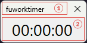
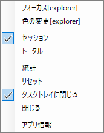
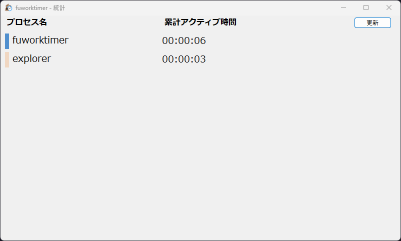
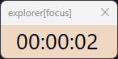
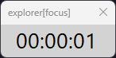
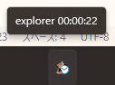
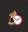

# fuworktimer
## 目次
- [機能](#kinou)
- [動作環境](#spec)
- [ダウンロード](#download)
- [確認してる不具合](#bug)
- [今後実装しようと思ってるもの](#feature)

## 
機能

#### メイン画面

1. 現在アクティブなウィンドウのプロセス名が表示されます。
1. 現在アクティブなウィンドウのアクティブ時間が表示されます。  
右クリックでメニューが開きます。

#### メニュー
各種設定などができます。  

- フォーカス[プロセス名] / フォーカス終了  
    [フォーカスモード](#focus)を切り替えます
    
- 色の変更[プロセス名]  
    新しいプロセスが登録される際自動で背景色が生成されます。任意の色を設定したい場合にはこの機能を使ってください。

- セッション / トータル (切り替え)  
セッションではアプリを起動してからのアクティブ時間が表示されます。  
トータルでは初回起動時からの累計アクティブ時間が表示されます。

- 統計  
統計ウィンドウを開きます。

- リセット  
セッションでのすべてのウィンドウのアクティブ時間をリセットします。トータルはリセットされません。

- タスクトレイに閉じる  
閉じるボタンを押したときアプリを終了せずタスクトレイに最小化します。
タスクトレイアイコンをクリックすると再表示されます。
タスクトレイアイコンを右クリックし閉じるを選択するとアプリを終了します。

- アプリ情報  
バージョン情報などを表示します

#### 統計ウィンドウ
登録されいているプロセスの累計アクティブ時間の一覧を確認できます。

#### 
フォーカスモード

特定のウィンドウで集中して作業したいときのモードです。  

プロセス名に追加で`[focus]`がつきます。  
自動切り替えがオフになります。表示が変わらないだけでアクティブ時間は加算されます。  
設定したウィンドウ以外がアクティブな間はカウントが停止し背景がグレーになります。

アクティブ時  
  

非アクティブ時  
  

#### タスクトレイ
アプリ起動後タスクトレイに常駐します。マウスホバーで現在の情報が表示されれます。  
  

フォーカスモード中は非アクティブ時にアイコンが変化します。  
  

## 
動作環境

動作確認ができている環境は以下です。
- Windows11
- [.NET 9.0 Desktop Runtime](https://dotnet.microsoft.com/ja-jp/download/dotnet/thank-you/runtime-desktop-9.0.2-windows-x64-installer)

## 
ダウンロード
[リリース](https://github.com/futa-t/fuworktimer/releases/latest/)から実行ファイル(fuworktimer.exe)を取得してください。  
SmartScreenの保護がでます。不安ならソースに目を通してから実行してください。

## 
確認してる不具合

- 累計時間がアプリを終了するタイミングによって日付が変わったあと引きつがれない。

## 
今後実装しようと思ってるもの

- 日毎や月毎でのセッション
- プロセス名ではなくウィンドウタイトルなどによる時間の記録
- 記録しないウィンドウの設定
- 累計ウィンドウでのソート
- csvなどでのエクスポート機能

## プロジェクトページ
[https://github.com/futa-t/fuworktimer](https://github.com/futa-t/fuworktimer)